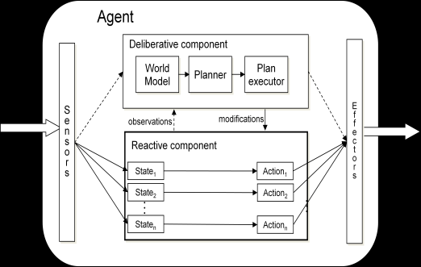

# Types of architecture of intelligent agents

There are several architectures that have been developed for intelligent agents. Here are a few examples:

## Belief-Desire-Intention (BDI) Architecture

BDI agents have beliefs about the world, desires or goals they want to achieve, and intentions or plans to achieve those desires

The process of practical reasoning in a BDI agent is presented in the figure below. As shown in this figure, there are seven main components in a BDI agent:

• *a set of current beliefs*, representing information the agent has about its current environment;

• *a belief revision function*, which takes a perceptual input and the agent’s current beliefs, and on the basis of these, determines a new set of beliefs

• *an option generation function*, (options), which determines the options available to the agent (its desires), on the basis of its current beliefs about its environment and its current intentions;

• *a set of current options*, representing possible courses of actions available to the agent;

• *a filter function (filter)*, which represents the agent’s deliberation process, and which determines the agent’s intentions on the basis of its current beliefs, desires, and intentions;

• *a set of current intentions*, representing the agent’s current focus – those states of affairs that it has committed to trying to bring about

• *an action selection function*, which determines an action to perform on the basis of current intentions.

## Reactive Agents

These agents don't maintain an internal model of the world and make decisions based on their current perceptual inputs only. They react to changes in the environment as they occur. Subsumption architecture developed by Rodney Brooks is a type of reactive architecture.

## Deliberative Agents

Deliberative agents maintain a model of the world and make decisions by deliberating over their knowledge using high-level cognitive functions. They plan ahead before taking action.

## Hybrid Agents

Hybrid architectures combine elements of both reactive and deliberative architectures. They have an internal model of the world like deliberative agents and can also react to changes in the environment as they occur like reactive agents

## Layered Architecture

In a layered architecture, different capabilities of an agent are separated into layers, which can each process input and produce output. Each layer can operate more or less independently, but they can also interact with each other

## Blackboard Architecture

In a blackboard architecture, different subsystems of an agent communicate by reading from and writing to a shared "blackboard". This architecture can be particularly useful for problem-solving and decision-making tasks where different subsystems need to cooperate to achieve a goal

Approach 1

Approach 2

Each architecture has its own strengths and weaknesses and is suited to different types of tasks and environments. The choice of architecture for an intelligent agent depends on the specific requirements of the task at hand.